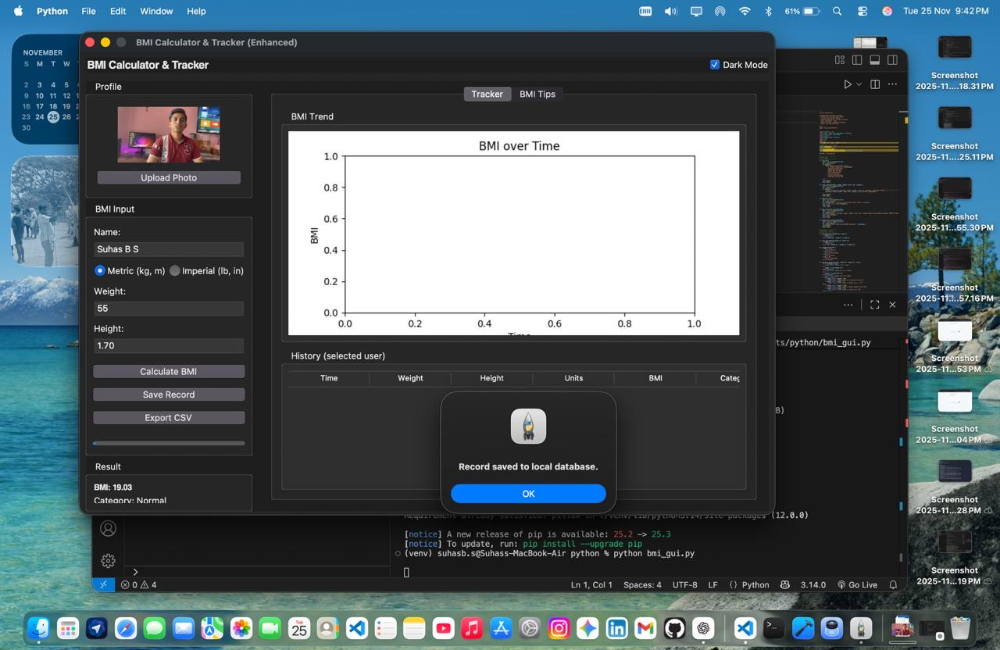

# 🧮 BMI Calculator & Health Tracker (Python • Tkinter • Matplotlib)

A modern, user-friendly **BMI (Body Mass Index) Calculator** with a full **health tracking system**, built using **Python, Tkinter (GUI), Matplotlib, and JSON storage**.  
This project allows users to calculate BMI, save historical data, view trends, and visualize health progress over time.

Built as part of my **OIBSIP Internship — Python Development**.

---

## ✨ Features

### ✅ BMI Calculator  
- Supports **Metric (kg, m)** and **Imperial (lb, in)** units  
- Calculates BMI instantly  
- Categorizes results as:  
  **Underweight, Normal, Overweight, Obesity**

### ✅ User Management  
- Add multiple users  
- Automatically stores data by name  
- Loads each user’s past BMI history

### ✅ Health History & Tracking  
- Saves all BMI results with:  
  - Timestamp  
  - Weight  
  - Height  
  - Units  
  - BMI score  
  - Category  

### ✅ Graph Visualization  
- Line graph showing user’s **BMI trend over time**  
- Real-time plotting using **Matplotlib**  

### ✅ Dark Theme UI  
- Clean, modern, smooth visual theme  
- Easy on the eyes  
- Professional look with sidebar layout

### ✨ Advanced Add-Ons  
- Progress bar animation during calculation  
- BMI tips panel  
- Optional profile photo support  
- Export history as CSV

---

## 🖼️ Screenshot

## 📸 Screenshots




---

## 🛠️ Tech Stack

- **Python 3**
- **Tkinter** — GUI interface  
- **Matplotlib** — Graph plotting  
- **JSON** — Local data storage  
- **CSV Export** — Downloadable history  
- **Pillow (optional)** — For profile photos  
- **OS / Pathlib** — File handling

---

## 📁 Project Structure

BMI_Calculator/
│
├── bmi_gui_enhanced.py # Main GUI application
├── bmi_data.json # Auto-generated user history
├── README.md # Project documentation
└── screenshot.png (optional) # Add your GUI screenshot

---

## ▶️ How to Run

### 1. Install dependencies
Inside your project folder:

```bash
pip install matplotlib pillow
2. Run the application
python bmi_gui_enhanced.py
The GUI window will open instantly.
📌 How to Use
1️⃣ Enter name
Example: Suhas
2️⃣ Select units
Metric (kg, m)
Imperial (lb, in)
3️⃣ Enter weight & height
4️⃣ Click Calculate BMI
5️⃣ Click Save Record
Your data is stored automatically.
6️⃣ Select a user
View complete BMI history.
7️⃣ Enjoy auto-generated BMI trend graphs!
🔮 Future Enhancements
Export graph as PNG
Cloud sync (Firebase / PostgreSQL)
Voice-enabled BMI assistant
Monthly health report PDF
Mobile version (Kivy)
👨‍💻 Author
Suhas B S
Python Development Intern – Oasis Infobyte
GitHub: github.com/suhasbs6263-ai
📜 License
This project is open-source and free to use for educational purposes.
