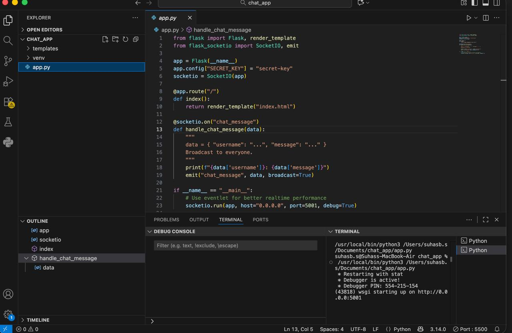

# 💬 Browser-Based Chat Application

A simple and fast real-time chat application built using **Python (Flask)** and **Socket.IO**.  
Multiple users can chat instantly through their browser using WebSockets.  
This project is part of the **OIBSIP Internship (Python Development)**.

---

## 🚀 Features
- Real-time messaging between multiple users  
- Works in any browser (Chrome, Safari, Edge)  
- Clean and simple UI  
- Lightweight Flask backend  
- Easy to run locally  

---

## 🛠️ Tech Stack
- Python  
- Flask  
- Flask-SocketIO  
- HTML  
- CSS  
- JavaScript  

---
## 📸 Screenshots

## ▶️ How to Run

**1. Install dependencies:**

pip install flask flask-socketio eventlet
2. Run the server:
python app.py
3. Open in browser:
http://127.0.0.1:5001
4. Test in multiple tabs:
Open the same link in two tabs → chat between them.
📁 Project Structure
Chat_Application/
 ├── app.py
 └── templates/
       └── index.html

👤 Author
Suhas B S
OIBSIP – Python Internship

