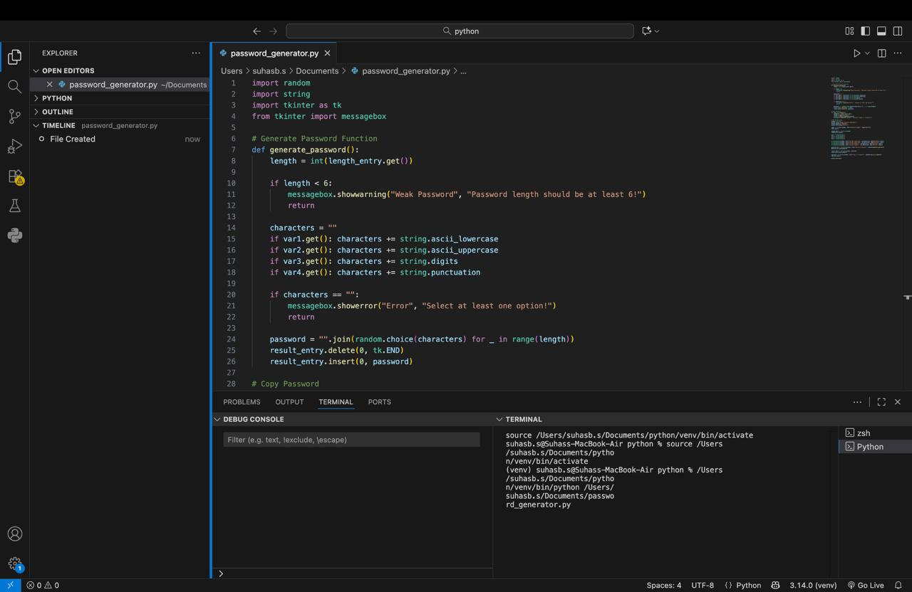

Random Password Generator 🔐

This project is built using **Python (Tkinter GUI)** for generating strong and highly secure passwords.

  Features
- Choose password length 💪
- Include lowercase, uppercase, digits & special characters 🔡🔢
- Clipboard copy feature 📋
- Smart validation ⚠️
- Clean and user-friendly interface 🎯

---

### 📸 Screenshots

---

### 🛠️ Tech Used
- Python
- Tkinter
- string & random module

---
### 👨‍💻 Developed By
**Suhas B.S**  
Python Programming Internship – Oasis Infobyte

